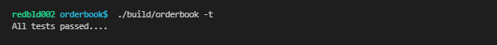

# Orderbook exercise

# Table of Contents
1. [Description of exercise](#synopsis)
2. [Implementation](#implementation)
3. [Testing](#testing-the-implementation)
4. [Potential improvements](#improvements)
5. [Conclusions](#conclusions)

## Synopsis
Order is a BUY or SELL instruction, which contains the following attributes:
OrderID
OrderAction [Add, Modify, Delete]
OrderDirection [BUY, SELL]
OrderConstraints [LIMIT, MARKET,etc…]
SecurityID
Price
Volume

### Tasks

1. Write an implementation for an Order Book which is ordered “Market-by-
price”.
Define the data types for the attributes of an Order.
Investigate and lookup terminology as needed to help you better understand
the domain.

2. How would you store the data? What data structure(s) would be best?
Consider resiliency and performance.
You can assume that all open Orders are cleared at the end of the day.

3. How would you improve the algorithm if you had to support 21 million
securities?
What data structures would you use and does that change your architecture?

## Implementation

### Defining an order

The first attempt at an order book struct is defined as follows:

```
    enum class OrderAction_t {
        Add, Modify, Delete  
    };

    enum class OrderDirection_t {
        BUY, SELL
    };

    enum class OrderConstraints_t {
        LIMIT, MARKET  
    };

    struct Order {
        int_fast64_t OrderID_;
        OrderAction_t OrderAction_;
        OrderDirection_t OrderDirection_;
        OrderConstraints_t OrderConstraints_;
        std::string SecurityID_;
        float Price_;
        int_fast64_t Volume_;
    };
 ```
    
`OrderID_` and `Volume_` were typed `int_fast64_t`, as potentially large volumes of trades might exceed the limits of a 32 bit int, which would be catastrophic for an orderbook. Details of the order are stored as enums. `SecurityID_` has been made a string, however as the default size for a string is generally larger than an identifier such as an ISIN, this could potentially made smaller. `Price` is a float, which should be sufficient to represent a price, however as floating point comparisons can sometimes be innacurate, some more thought could be given here. In summary, there could be changes to improve the memory footprint particularly, which are discussed [later](#improvements).

### Order book structure

The main lookup of the security id has been implemented as an `unordered_map`:

```
    using Book = std::unordered_map<std::string, Security>;
```

The rationale is that while a regular `std::map` will perform well for small collections, even logarithmic complexity look-ups will have a cost as the number of securities becomes large. An unordered_map, while comsuming extra memory, should have a near constant time look-up complexity. A `Reserve` function was added to the implementation to size the map appropriately at the start of the day. As an unordered map is implemented as an array, there is the potential for triggering a lot of memory re-allocations and copies until we receive all symbols that comprise the market. 

The sides of the book have been aggregated in a `Security` struct and are implemented as std::maps:

```
    using BidLevels = std::map<float, std::deque<Order>, std::greater<float>>;
    using AskLevels = std::map<float, std::deque<Order>, std::less<float>>;
    
    struct Security {
        BidLevels bid_;
        AskLevels ask_;
    };
```

The thinking here is that book depths are pretty finite in terms of size, so look-ups on price should be relatively quick. Insertions and deletions from the front and end of the should be constant time and also have logarithmic complexity elsewhere. Resizing of the container will not be a problem as maps are generally implemented as a red black binary trees. Using any hash based container here is not an option as we need to maintain ordering. We are using `std::greater` and `std::less` to make sure that bids are ordered in ascending price and offers in descending order.

At each price level, we have a `std::deque`, to aggregate the orders:

```
  std::deque<Order>
```
  
Assuming order number will be sequentially incrementing, a queue is a good structure in order to store these sequential elements. Insertions of Orders at the front and removals from the back will be optimised for a deque. As the orders are ordered, look-ups can be done using binary search, which will have O(log n) complexity similar to a set. However a potential performance benefit for using a deque over a set is a deque should be more cache friendly.
  
## Testing the implementation
  
To validate the orderbook, a test 'feed' was implemented, using 2 test securities, Facebook and Google. Bid and offers were added, modified and deleted and the results checked. In order to check the logic of the operations, the same orders at the same price were reversed between the two symbols and produced the same books. For regression testing, some simple unit tests were written, comparing how many symbols the book had, the book depths and the individual Orders at each price level.



            
## Improvements
            
The 21 million securities question is an interesting one. In terms of the algorithm, it should be pretty unaffected by the number of securities. The used of an `unordered_map` should help us here as far as speed is concerned. 
                                                                                                
In terms of the data structures themselves, it's clear that while nice an readable, the original `Order` structure is certainly not optimised for size. A more space optimised structure was made to see what scope there was to minimise this footprint. The main difference here being the use of bitfields and fixed length arrays:
            
```
    constexpr unsigned short ORDER_ACTION_ADD = 1;
    constexpr unsigned short ORDER_ACTION_MODIFY = 2;
    constexpr unsigned short ORDER_ACTION_DELETE = 3;

    constexpr unsigned short ORDER_DIRECTION_BUY = 0;
    constexpr unsigned short ORDER_DIRECTION_SELL = 1;

    constexpr unsigned short ORDER_CONSTRAINT_LIMIT = 0;
    constexpr unsigned short ORDER_CONSTRAINT_MARKET = 1;

    constexpr unsigned int ID_LEN = 13;

    struct Order {
        int_fast64_t OrderID_;
        unsigned short OrderAction_ : 2;
        unsigned short OrderDirection_ : 1;
        unsigned short OrderConstraints_ : 1;
        char SecurityID_ [ID_LEN]; 
        float Price_; 
        int_fast64_t Volume_;
    };
```  

In test the following space savings were achieved:
            

  
## Conclusions
  
With limited time, it's probably not the ultimate orderbook implementation, however seems reasonably efficient. With testing, the relative efficiencies of the various containers would become clearer and could be benchmarked. Also, a bit of business knowledge can also help to optimise further. For instance, what's the initial size to set the main map in order avoid re-allocation/copying? With knowledge of the typical trading patterns, could searches be optimised to target the top of the book rather than the full depth for example? 


    
